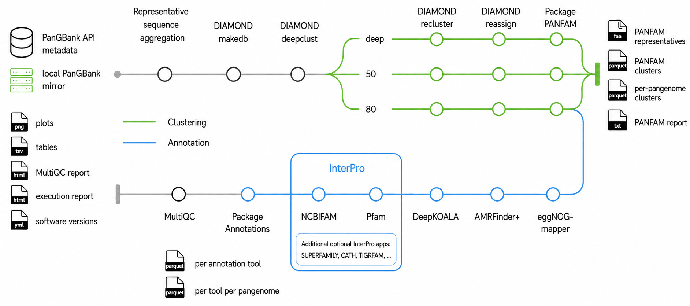

# PanGBank-annotator

<!-- [](https://github.com/codespaces/new/labgem/PanGBank-annotator) -->

[](https://github.com/labgem/PanGBank-annotator/actions/workflows/nf-test.yml)
[](https://github.com/labgem/PanGBank-annotator/actions/workflows/linting.yml)
[](https://www.nf-test.com)

[](https://www.nextflow.io/)
[](https://github.com/nf-core/tools/releases/tag/4.0.2)
[](https://docs.conda.io/en/latest/)
[](https://www.docker.com/)
[](https://sylabs.io/docs/)
[](https://cloud.seqera.io/launch?pipeline=https://github.com/labgem/PanGBank-annotator)

## Introduction

**PanGBank-annotator** is a workflow for building PANFAM protein clusters from PanGBank pangenome family representatives and annotating the resulting representative sequences.

The current implementation includes the following steps:

1. Resolve a PanGBank collection release and collection (`GTDB_all` or `GTDB_refseq`).
2. Fetch all protein families of each pangenome and build a pangenome-family map.
3. Run DIAMOND `deepclust`, followed by `recluster` and `reassign` corrections.
4. Package clusters into PANFAM parquet files and representative FASTA files.
5. Annotate PANFAM80 representatives with InterProScan6, DeepKOALA, eggNOGMapper, and AMRFinder+.
6. Package annotation results and generate a comprehensive multiQC report.

<picture>
  <source media="(prefers-color-scheme: dark)" srcset="docs/images/workflow_dark.png">
  <source media="(prefers-color-scheme: light)" srcset="docs/images/workflow_light.png">
  
</picture>

## Usage

> [!NOTE]
> If you are new to Nextflow and nf-core, please refer to [this page](https://nf-co.re/docs/get_started/environment_setup/overview) on how to set-up Nextflow. Make sure to [test your setup](https://nf-co.re/docs/get_started/run-your-first-pipeline) with `-profile test` before running the workflow on actual data.

Detailed run examples are available in [docs/usage.md](docs/usage.md), including
stub runs, built-in tests, clustering-only, annotation-only, full runs, custom
FASTA input, annotation tool selection, and raw output controls.

Stage-specific details are in [docs/clustering.md](docs/clustering.md) and
[docs/annotation.md](docs/annotation.md). Annotation database setup is covered
in [docs/databases.md](docs/databases.md).

## Technical Notes

- DIAMOND is currently pinned to 2.1.13 for all clustering steps. v2.1.24 fails during
  `reassign`, and v2.2.4 temporarily removed `reassign`. The DIAMOND modules
  declare both Conda and container execution for this pinned version.

- DeepKOALA is run from a dedicated container image and external model resources.
  Build the default image from `modules/local/deepkoala/Dockerfile` and provide
  the resources directory with `--deepkoala_resources`.

- Imported InterProScan 6 is tracked as an upstream Git submodule. Until the
  upstream `sequences.db` [reported issue](https://github.com/ebi-pf-team/interproscan6/issues/340) is fixed, initialize the submodule and
  apply the local temporary patch before running imported InterProScan:

```bash
git submodule update --init --recursive
bin/apply_interproscan6_patches.sh
```

## Citations

An extensive list of references for the tools used by the pipeline can be found in the [`CITATIONS.md`](CITATIONS.md) file.
